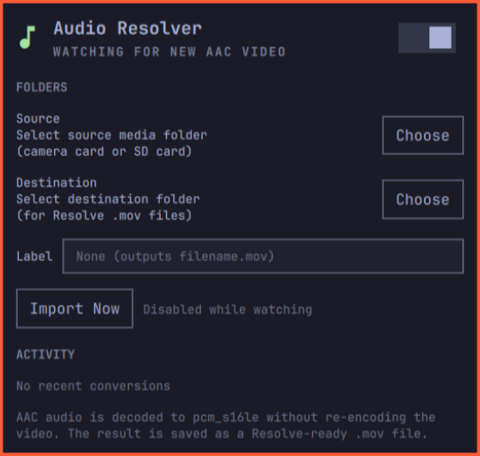

# Audio Resolver

Audio Resolver is an Omarchy status bar plugin that prepares camera footage
for DaVinci Resolve on Linux. Resolve cannot decode AAC audio on Linux, so the
plugin converts AAC tracks to uncompressed PCM 16-bit (`pcm_s16le`) and saves
the result in a Resolve-ready `.mov` file. The video stream is copied without
re-encoding, so conversion is fast and preserves the original image quality.



Choose a source media folder, such as a camera or SD card, and a destination
folder for the converted `.mov` files. Enable the watcher to process new
footage automatically, including files already present when watching starts.
When the watcher is stopped, **Import Now** performs a one-time batch import.
Original media is never modified.

Audio Resolver tracks each source file by its path, size, and modification
time, so changing the optional filename label does not re-import unchanged
media. For example, an empty label creates `filename.mov`; a label of `_pcm`
creates `filename_pcm.mov`.

## Requirements

- `ffmpeg` and `ffprobe`
- `inotify-tools`
- `xdg-desktop-portal` (via `omarchy file select`)

## Install

```bash
omarchy plugin add https://github.com/techwhispers/omarchy-audio-resolver
omarchy plugin enable quazix.audio-resolver right
```

## Uninstall

Disable the widget first, then remove its local plugin directory:

```bash
omarchy plugin disable quazix.audio-resolver
rm -rf ~/.config/omarchy/plugins/quazix.audio-resolver
omarchy restart shell
```

Audio Resolver also installs a user service and stores its settings and import
history outside the plugin directory. Remove them separately only if you want
to delete all local data:

```bash
systemctl --user disable --now audio-resolver.service
rm -rf ~/.config/audio-resolver ~/.local/state/audio-resolver
rm -f ~/.config/systemd/user/audio-resolver.service
systemctl --user daemon-reload
```

## Security

Audio Resolver runs as the logged-in user inside the unsandboxed Omarchy shell.
It does not make network requests or require elevated privileges. Folder paths
are passed as arguments to the picker, `ffmpeg`, `ffprobe`, and helper scripts;
configuration files are written with shell-safe quoting. The watcher only reads
files from the selected source folder and writes converted files to the
selected destination.

As with any local shell plugin, only install it from a repository you trust and
review updates before enabling it. `ffmpeg`, `ffprobe`, `inotifywait`, and the
Omarchy file picker are external dependencies.

## License

Audio Resolver is released under the MIT License. See [LICENSE](LICENSE).
